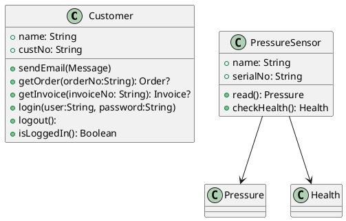
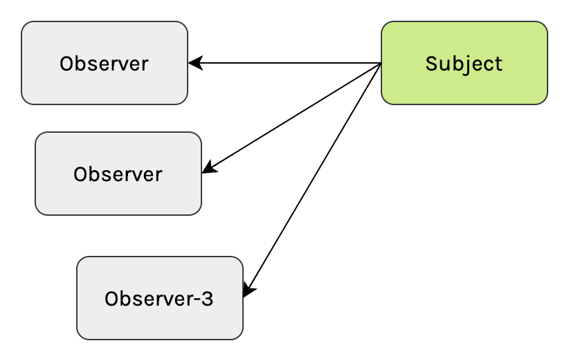

# Observer Pattern

This pattern is part of the behavioral patterns in software design. Like all patterns it is not only important to know why we want to use this pattern, but also when do not want to use this pattern.

## Intent

1. When dependent object within a software system needs to know when object (the subject), changes state.
2. Ensure that objects within a software system is loosely coupled but have high cohesion.

### Some Prerequisites

Understanding the phrase, "High cohesion and low coupling". This is one those phrases which we all hear an explanation for, and immediately afterwards. Personally I think the reason for this is that whole sentence reeks of cogitative dissonance, So our (over "logical" brain just kills it off before we can even think about remembering it).

So lets first go with the a common explanation:

> ...high cohesion means keeping related code together in a single module or class, while low coupling means minimizing dependencies between different modules or classes. These concepts are important for creating maintainable, scalable, and reliable software systems.

Lets look at ***Cohesion***:

This sounds still very complex, but the application of it is actually not that difficult. Consider these two classes:

Consider responsibilities of each classes:

|     | `Customer`         | `PressureSensor`  |
| --- | ------------------ | ----------------- |
| 1   | change `name`      | change `name`     |
| 2   | change `custNo`    | change `serialNo` |
| 3   | Sending email      | Reading Sensor    |
| 4   | Accessing Orders   | -                 |
| 5   | Accessing Invoices | -                 |
| 6   | Security           | -                 |

Operations related not to class:

- Customer : 4
- Pressure Sensor : 0

The `Customer` class has the lowest cohesion since features 4 operation which has no direct relation to itself. While the `PressureSensor` class functions and attributes related directly to the concept of sensor.

Coupling is simply dependencies a class has on other classes. In this case the pressure sensor class is dependent on the `Pressure`(Reading), and `Health` classes. And nothing more. Further if these classes do no originate from separate modules, they can be ignored.

## Reasons for not using the pattern

1. When this pattern introduces needles coupling between two systems.
2. When the order of notifications are of concern.

## What is this pattern

We're dealing with 2 objects:

1. A subject. This is the object which are being observed.
2. An observer, which is the object which observes the subject.

### Typical Flow

1. Observer attach to an Subject
2. When the Subject changes state it, signals each observer that it's state has changed.
3. When an Observer does need to, or care to know about anymore state changes, it detaches from the subject.

## Demonstrations

### Simple Demo - In Vehicle Fleet Monitoring System (IFMS)

#### Version 1

1. Driver unlocks the vehicle using his electronic key card.
2. IFMS detects that a valid driver is using the vehicle.
3. IFMS immediately:
   - Switch on the vehicles dashboard.
   - switch on cabin lights on the front seats.
4. Driver switch on the car to drive.
   - IFMS detects that engine is starting.
   - IFMS checks battery level
   - IFMS checks fuel level
   - Logs trip start:
      - Start date and time.
      - Mileage
      - Fuel level
5. Driver starts his journey
6. Driver stops his journey
7. IFMS:
   - Logs end of trip:
     - Date and time
     - Millage
     - Fuel Level

#### Version 2

Owner of the fleet had GPS devices installed to track trip locations. Ultimately this is to ensure that vehicles operates not only within fuel budget, but also aid in the recovery of the vehicle in case of hijacking and theft. As part of this initiative IFMS needs to implement the following:

1. When the vehicle start and end a trip it should also log the geo coordinates of the vehicle.
2. In addition, while the vehicle is outside of the a company depot, it should continuously broadcast the vehicles location, fuel level, and date time stamp.
3. When a vehicle enters a depot, it should dump detailed censor logs to the company server (via WIFI).

##### Important to note

1. Not all vehicles may have GPS installed (yet)
2. Not all vehicles may have network capabilities.

#### Naive implementation

##### Problems with this implementation

#### Better Implementation

##### Objectives refactoring needs to achieve

1. Prevent coupling between the IFMS monitoring logic and censor components.
2. Deal with situations where there are no GSM network capabilities.
3. Make it easy for a developer/maintenance engineer to follow the logic.
