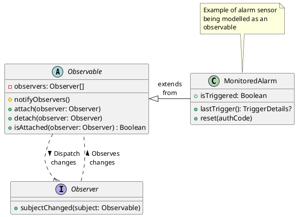
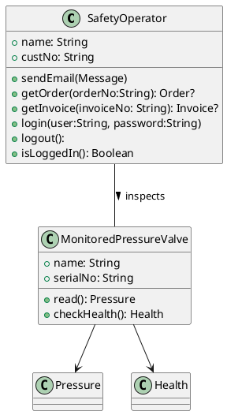

# Observer Pattern - The story of good, (but mostly bad) software

This pattern is part of the behavioral patterns in software design. Like all patterns it is not only important to know why we want to use this pattern, but also when do not want to use this pattern.

> Also consider that since Java 1.x there exists an Observable implementation which is now deprecated.

## What and Why

1. What happens: When dependent object within a software system needs to know when object (the subject), changes state.
2. Why: Ensure that objects within a software system is loosely coupled but have high cohesion.

## Implementing this pattern

We're dealing with 2 objects:

1. A subject. This is the object which are being observed.
2. An observer, which is the object which observes the subject.

## Typical implementation

Things to note:

- There may be multiple observers which gets notified.
- The observer needs to be attached to the subject to know of any changes.
- The observable is an abstract class.

### Typical Flow

1. Observer attach to an Subject
2. When the Subject changes state it, signals each observer that it's state has changed.
3. When an Observer does not need to, or does not care to know about anymore state changes, it detaches from the subject.

## Reasons for not using the pattern

1. When this pattern may introduces needles coupling between two systems.
2. When the order of notifications are of concern.
3. Introduces overhead (observers needs to be managed)
4. Makes it difficult to reason about a system:
   - Coupling in unexpected places.
   - Logic/Flow can be attached anywhere the observer is exposed.
   - Makes it difficult to debug, as bugs may be hide side effects.
5. If overused, tends to produced brittle/buggy software due to issues of different life cycles the observer and subject. Consider that most observers are transient. So the subject must be able to deal with observers going away (even abnormally).

## When should I use this pattern?

1. When there us clear one to many relationship between related entities.
2. When this relationship needs to change in some dynamic way, either in design or during runtime.
3. When you want to implement an hand off between systems, and do not want disturb your domain model (more than just observing it).

## How should I use this pattern?

1. Be very careful not to expose the observer outside of your model, as it may invite others to attach to your model without observing the life cycle of your model.
2. Be aware that the actual changes only gets exposed by caller the subject. Such a call may be expensive over a network. So do not use it as pub sub system.
3. Always threat observables as low level internal API.
4. Handle bad observers.
5. Consider concurrency issues.

### Background

Understanding the phrase, "High cohesion and low coupling". This is one those phrases which we all hear an explanation for, and immediately afterwards. Personally I think the reason for this is that whole sentence reeks of cogitative dissonance, So our (over "logical" brain just kills it off before we can even think about remembering it).

So lets first go with the a common explanation:

> ...high cohesion means keeping related code together in a single module or class, while low coupling means minimizing dependencies between different modules or classes. These concepts are important for creating maintainable, scalable, and reliable software systems.

Lets look at ***Cohesion***:

This sounds still very complex, but the application of it is actually not that difficult. Consider these two classes:

Consider responsibilities of each classes:

|     | `Customer`         | `MonitoredPressureValve` |
| --- | ------------------ | ------------------------ |
| 1   | change `name`      | change `name`            |
| 2   | change `custNo`    | change `serialNo`        |
| 3   | Sending email      | Reading Sensor           |
| 4   | Accessing Orders   | -                        |
| 5   | Accessing Invoices | -                        |
| 6   | Security           | -                        |

Operations related not to class:

- Customer : 4
- Pressure Sensor : 0

The `Customer` class has the lowest cohesion since features 4 operation which has no direct relation to itself. While the `MonitoredPressureValve` class functions and attributes related directly to the concept of sensor.

Coupling is simply dependencies a class has on other classes. In this case the pressure sensor class is dependent on the `Pressure`(Reading), and `Health` classes. And nothing more. Further if these classes do no originate from separate modules, they can be ignored.
